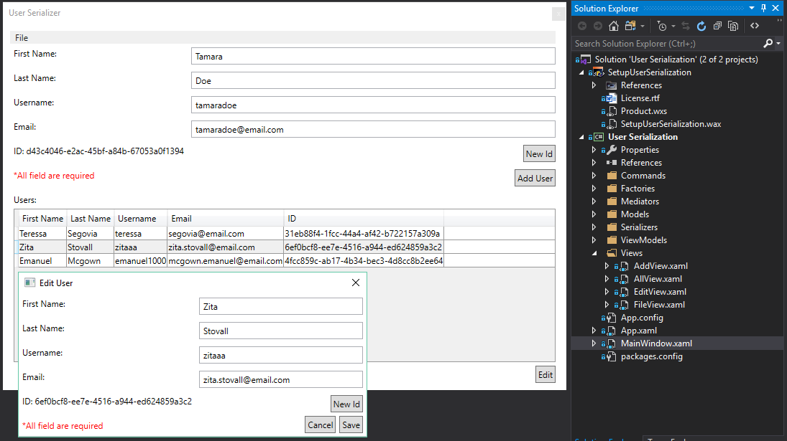

# User Serialization

Desktop, WPF application that can serialize & deserialize data in Xml, Json & Binary format.

## Why it's made?

To cover various features of WPF framework, mainly MVVM architecture, it's building blocks and Wix installer.

Also other features such as: serialization, design patterns, pubsub/observables, ...